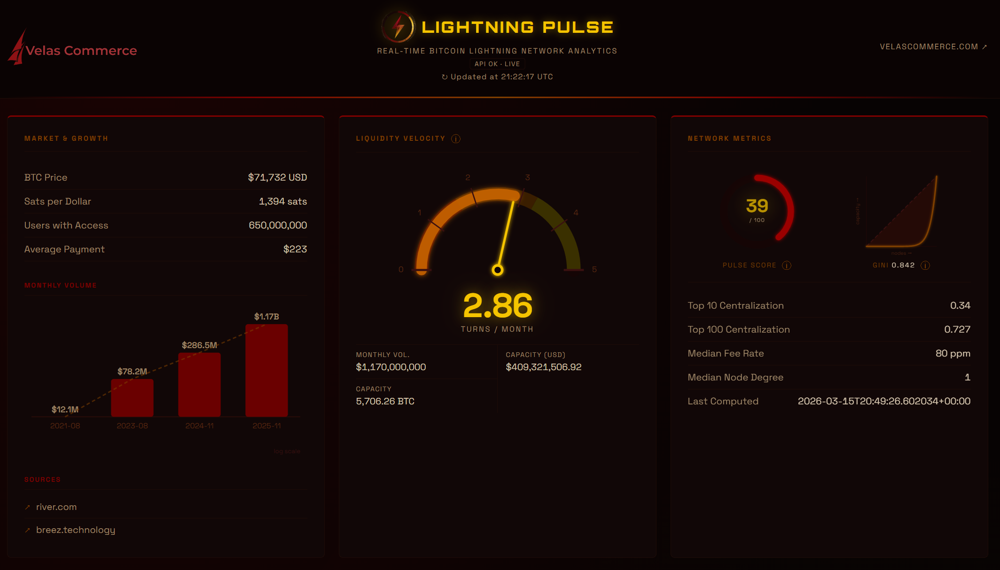

# Lightning Pulse ⚡

Real-time Bitcoin Lightning Network analytics dashboard, built by [Velas Commerce](https://velascommerce.com).



## What it shows

- **Network Metrics** — Pulse Score, Gini coefficient, Lorenz curve, centralization stats
- **Network Topology** — Side-by-side comparison of your LND node's graph vs. Mempool.space's view
- **Liquidity Velocity** — How efficiently capital is being used across the network
- **Market & Growth** — Monthly transaction volume (animated bar chart), user growth, BTC price
- **Nodes by Country** — Interactive world map with hover tooltips and top-10 legend
- **Largest Nodes** — Top 20 nodes ranked by total channel capacity

Data refreshes automatically every 60 seconds.

## Stack

| Layer        | Tech                                              |
| ------------ | ------------------------------------------------- |
| Frontend     | React + TypeScript + Vite                         |
| Backend      | FastAPI (Python)                                  |
| LND data     | Your own LND node via REST API                    |
| Network data | [Mempool.space](https://mempool.space) public API |
| Fonts        | Orbitron (headings) · Space Grotesk (body)        |

## Running locally

### Prerequisites

- Python 3.11+
- Node.js 18+
- A running LND node with REST API enabled and a readonly macaroon

### Backend

```bash
# Clone and enter the project
git clone https://github.com/velascommerce/lightning-pulse.git
cd lightning-pulse

# Create and activate a virtual environment
python -m venv .venv
source .venv/bin/activate  # Windows: .venv\Scripts\activate

# Install dependencies
pip install -r requirements.txt

# Configure environment
cp .env.example .env
# Edit .env with your LND_URL, LND_READONLY_MACAROON_HEX, and LND_TLS_CERT_PATH

# Start the API server
uvicorn main:app --reload
```

The API will be available at `http://localhost:8000`.

### Frontend

```bash
cd frontend
npm install

# Optional: set the API URL (defaults to localhost:8000)
cp .env.example .env

npm run dev
```

The dashboard will be available at `http://localhost:5173`.

## Environment variables

### Backend (`.env`)

| Variable                    | Description                                                                    |
| --------------------------- | ------------------------------------------------------------------------------ |
| `LND_URL`                   | Base URL of your LND REST API (e.g. `https://your-node-ip:8080`)               |
| `LND_READONLY_MACAROON_HEX` | Hex-encoded readonly macaroon                                                  |
| `LND_TLS_CERT_PATH`         | Path to your LND TLS cert file (local dev)                                     |
| `TLS_CERT_B64`              | Base64-encoded TLS cert (production/Railway — takes priority over path)        |
| `CORS_ORIGINS`              | Comma-separated allowed frontend origins (defaults to `http://localhost:5173`) |

Generate `TLS_CERT_B64` from your cert file:

```powershell
# PowerShell
[Convert]::ToBase64String([IO.File]::ReadAllBytes("tls.cert"))

# Linux / Mac
base64 -w0 tls.cert
```

### Frontend (`frontend/.env`)

| Variable       | Description                                           |
| -------------- | ----------------------------------------------------- |
| `VITE_API_URL` | Backend API URL (defaults to `http://localhost:8000`) |

## Deployment

The project is designed to deploy as two separate services:

- **Backend** — any Python host (Railway, Fly.io, etc.). Set all backend env vars in the host's dashboard.
- **Frontend** — any static host (Vercel, Netlify, Railway). Set `VITE_API_URL` before building: `npm run build`.

## License

MIT — free to use, fork, and adapt.

---

Built with ⚡ by [Velas Commerce](https://velascommerce.com)
